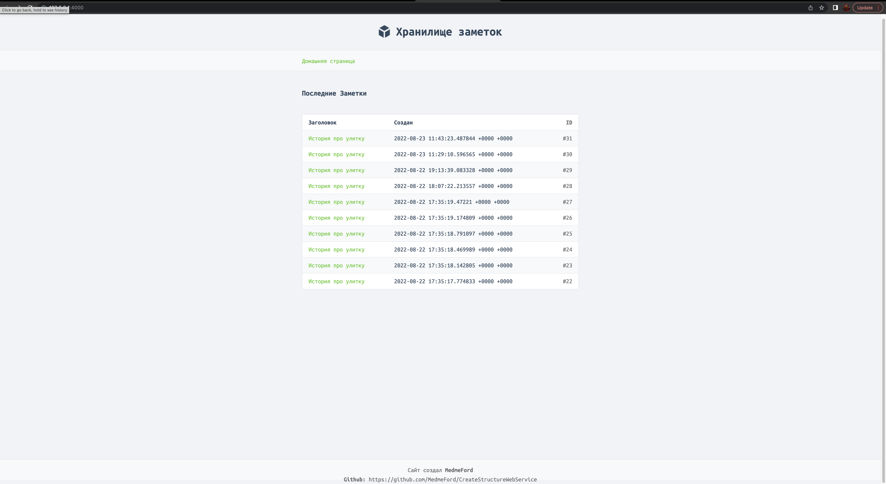
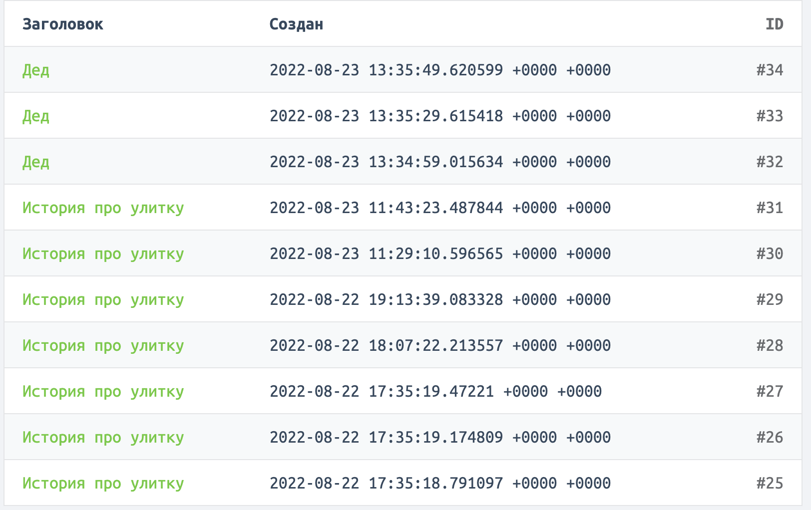

# CreateStructureWebService

`To run go run . in cmd/web directory And enable the Postgres database by first connecting it in the initialization line (it is important to give the user rights to insert )`
